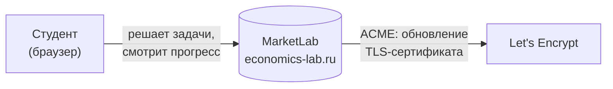
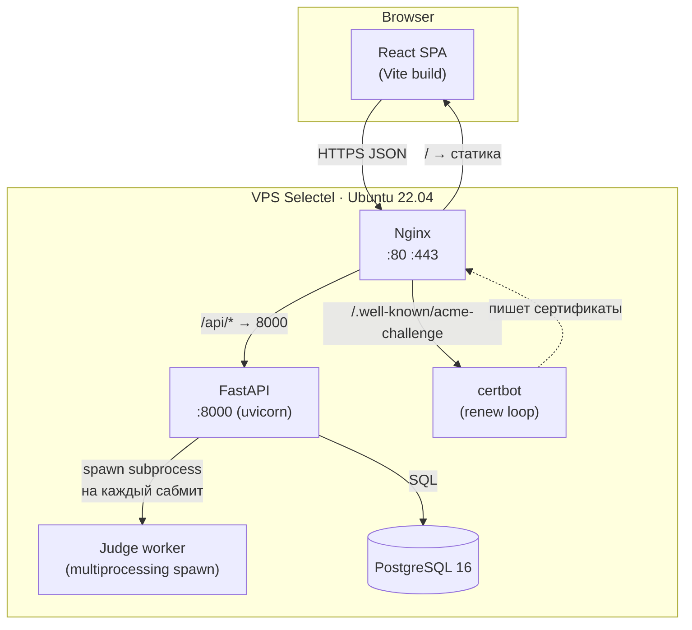
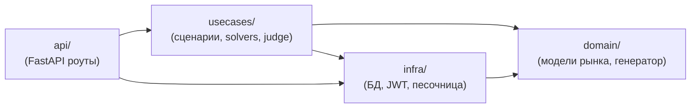

# MarketLab

Тренажёр по микроэкономике: вместо того чтобы решить одну задачку с конкретными числами, ты пишешь `solve(params)`, которая работает для **любых** параметров. Сервис гоняет её на 25 случайных тестах и честно говорит, где и на чём сломалось.

🌐 **[economics-lab.ru](https://economics-lab.ru)**

---

## Оглавление

- [Для пользователя](#для-пользователя)
  - [Идея](#идея)
  - [Как это работает](#как-это-работает)
  - [20 задач внутри](#20-задач-внутри)
  - [Скриншоты](#скриншоты)
- [Для разработчика](#для-разработчика)
  - [Стек](#стек)
  - [Архитектура (C4: Context)](#архитектура-c4-context)
  - [Архитектура (C4: Containers)](#архитектура-c4-containers)
  - [Слои и зависимости](#слои-и-зависимости)
  - [Структура репозитория](#структура-репозитория)
  - [Судья: как это работает внутри](#судья-как-это-работает-внутри)
  - [Генератор тестов](#генератор-тестов)
  - [Нетривиальные решения](#нетривиальные-решения)
  - [Сознательные компромиссы](#сознательные-компромиссы)
  - [Локальный запуск](#локальный-запуск)
  - [Деплой](#деплой)

---

# Для пользователя

## Идея

На экономике обычно так: преподаватель даёт числа — `a=120, b=3, c=−10, d=2` — и просит найти равновесную цену. Подставил в формулу, получил ответ, пошёл дальше. Понял ли ты при этом *почему* формула именно такая? Не факт.

MarketLab проверяет иначе. Тебе нужно написать **программу**, которая решает задачу не для одного конкретного примера, а для любых параметров. Это принципиально сложнее: нужно понять логику модели, а не просто запомнить формулу.

Каждая тема микроэкономики — отдельная задача. Пишешь `solve(params)`, жмёшь «Проверить» — и узнаёшь, работает ли твоя логика на 25 случайно сгенерированных тестах. AC значит, что понял. WA — система покажет, на каком именно тесте и на сколько разошлось.

## Как это работает

**1. Открываешь каталог** — 20 задач, у каждой тема и сложность. Фильтры помогают найти нужную.

**2. Читаешь условие** — задача сформулирована как настоящая экономическая история (рынок яблок, рынок труда, импортный тариф), а рядом — формальная модель: функции спроса и предложения, входные параметры, что нужно вернуть.

**3. Пишешь код** прямо в браузере. Шаблон уже есть — нужно только реализовать тело `solve`.

**4. Отправляешь** — сервер запускает код в изолированной песочнице и гоняет на 25 тестах. Результат один из четырёх:

| Вердикт | Что произошло |
|---|---|
| ✅ **AC** — Accepted | Все 25 тестов прошли. Задача решена. |
| ❌ **WA** — Wrong Answer | На каком-то тесте ответ не совпал с эталоном. Покажем входные данные, ожидаемый и полученный результат — поймёшь, где ошибка. |
| 💥 **RE** — Runtime Error | Код упал с исключением (деление на ноль, неправильный ключ и т. д.). |
| ⏱ **TLE** — Time Limit | Решение работает дольше 1 секунды на тест. Обычно означает бесконечный цикл. |

**5. Смотришь прогресс** — в личном кабинете видно, сколько задач решено и история попыток.

## 20 задач внутри

| Тема | Задачи |
|---|---|
| Равновесие | Конкурентное равновесие, сдвиг спроса, сдвиг предложения, одновременный сдвиг, потолок цены, ценовой пол |
| Благосостояние | CS/PS, потери от налога (DWL), госзакупки по цене поддержки, выигрыш от технологического прогресса |
| Налоги и субсидии | Удельный налог, НДС, кривая Лаффера |
| Эластичность | Точечная эластичность спроса, эластичность по доходу, оптимальная цена (max выручки) |
| Агрегирование | Сложение индивидуальных спросов |
| Монополия | Равновесие монополиста vs конкурентный рынок |
| Внешние эффекты | Налог Пигу |
| Внешняя торговля | Импортный тариф |

## Скриншоты

| Каталог задач | Страница задачи |
|---|---|
|  |  |

| График спроса и предложения | Разбор неверного ответа |
|---|---|
|  |  |

| Принятое решение |
|---|
|  |

---

# Для разработчика

## Стек

Python 3.12 · FastAPI · SQLAlchemy 2 · PostgreSQL 16 · React 18 + TypeScript + Vite · Tailwind · Recharts · Docker · Nginx · Let's Encrypt.

## Архитектура (C4: Context)



Сервис полностью автономный — никаких внешних API. Единственный исходящий контакт — автообновление TLS через ACME у Let's Encrypt.

## Архитектура (C4: Containers)



## Слои и зависимости

Луковичная архитектура: внутренние слои не знают про внешние.



- **domain** — dataclass-ы (`LinearDemand`, `MarketPolicy`, `TaskSpec`) и генератор. Ноль зависимостей от FastAPI / SQLAlchemy.
- **usecases** — `solve_*` функции (эталонные решения) и `judge_v1` (оркестрация запуска кода).
- **infra** — SQLAlchemy-репозитории, JWT, subprocess-runner судьи.
- **api** — тонкий HTTP-слой: принять запрос, вызвать usecase, вернуть ответ.

## Структура репозитория

```
marketlab/
├── backend/
│   ├── src/marketlab/
│   │   ├── api/              # роуты, схемы, зависимости, rate-limit
│   │   ├── domain/           # ядро: модели, генератор тестов, типы задач
│   │   ├── usecases/
│   │   │   └── solvers/      # по файлу на задачу — эталонные решения
│   │   └── infra/            # БД, JWT, subprocess-runner судьи
│   └── tests/                # pytest: domain, judge, API, solvers
├── frontend/
│   ├── src/
│   │   ├── pages/            # TaskCatalog · SolvePage · MyProgress · Auth
│   │   ├── components/       # Layout и общие компоненты
│   │   └── api/              # клиент REST API
│   ├── nginx.prod.conf
│   └── Dockerfile            # multi-stage: node:20 → nginx:alpine
├── docker-compose.yml        # локальный dev
└── docker-compose.prod.yml   # прод (db + backend + nginx + certbot)
```

## Судья: как это работает внутри

Файл: [`runner_inprocess.py`](backend/src/marketlab/infra/judge/runner_inprocess.py)

Задача судьи — запустить чужой Python-код так, чтобы он не мог навредить серверу, и убить его, если завис.

Первая идея была простой: `exec` прямо в процессе FastAPI с `threading.Timer` для таймаута. Быстро выяснилось, что это не работает — Timer лишь поднимает флаг, а остановить крутящийся в интерпретаторе `while True` он не может. Код висит, поток заблокирован, следующий сабмит ждёт.

Второй вариант — `fork`. Форкнуть процесс, в дочернем убивать по таймауту. Тоже не подошло: FastAPI работает с пулом потоков, а `fork` в многопоточном процессе может скопировать заблокированные мьютексы → дедлок.

Итоговое решение: `multiprocessing.get_context("spawn")`. `spawn` поднимает чистый интерпретатор без унаследованных потоков. Внутри подпроцесса — `signal.SIGALRM` на каждый тест (работает только в main-thread, а в spawn-процессе мы именно там). Родитель ждёт с `proc.join(timeout=N+10)` и убивает, если не дождался.

Сверху — `threading.Semaphore`, чтобы при пиковой нагрузке судьи не съели всю память VPS.

## Генератор тестов

Файл: [`generator.py`](backend/src/marketlab/domain/generator.py)

Для каждой задачи — своя функция `_gen_*`. Она случайно выбирает параметры, прогоняет через эталонный солвер и проверяет, что равновесие получилось нормальным (цена и объём положительны, излишки неотрицательны). Вырожденные случаи отбрасываются и генерируются заново.

Для задач с режимами (`mode: none | tax | subsidy`) выборка намеренно балансируется — чтобы все ветки решения проверялись, а не только самый простой случай.

## Нетривиальные решения

**`spawn` вместо `fork`.**
FastAPI обрабатывает запросы в нескольких потоках. `fork` копирует всё состояние процесса включая заблокированные мьютексы от других потоков — в дочернем процессе они никогда не разблокируются, программа зависает. `spawn` стартует чистый интерпретатор без этой проблемы.

**`SIGALRM` вместо потокового таймаута.**
`threading.Timer` не может прервать выполняющийся Python-байткод — он лишь ставит флаг, который проверяется между инструкциями. Бесконечный цикл этот флаг никогда не увидит. `SIGALRM` — сигнал ОС, он прерывает выполнение безусловно. Ограничение: работает только в main-thread, поэтому и нужен subprocess.

**Генератор с отбраковкой.**
Для части задач случайные параметры могут дать вырожденное равновесие (отрицательная цена, нулевой объём). Вместо того чтобы городить сложную аналитическую проверку входных диапазонов для каждой из 20 задач, проще просто попробовать — и отбросить, если не подошло. На практике нужно 1–3 попытки.

## Сознательные компромиссы

**Без очереди задач (Celery / RQ).**
Celery добавил бы Redis, отдельный worker-процесс, мониторинг очереди — при том что нагрузка на судью ограничена семафором прямо в FastAPI. Для текущего масштаба это избыточно.

**Без контейнеризации каждого сабмита (Docker-in-Docker, gVisor).**
Полная контейнерная изоляция надёжнее, но требует привилегированного Docker-демона или отдельного runtime. Для учебного сервиса достаточно exec-песочницы с белым списком builtin-ов и process-изоляции через spawn.

**`exec` вместо компилятора.**
Студенческий код — это всегда короткая функция `solve`, а не произвольная программа. `exec` с подменёнными `__builtins__` здесь проще и достаточно надёжен. Если бы пользователи могли загружать модули или использовать `ctypes` — нужно было бы что-то серьёзнее.

**Линейные функции спроса и предложения.**
Все 20 задач работают на линейных D/S. Это сознательное ограничение: аналитические решения существуют и их можно проверить точно (без численных методов), а сами задачи уже достаточно разнообразны за счёт разных экономических механизмов.

## Локальный запуск

```bash
# БД + backend
cp .env.prod.example .env
# в .env поставь любые непустые POSTGRES_PASSWORD и SECRET_KEY
docker compose up -d

# Frontend
cd frontend && npm install && npm run dev
# → http://localhost:5173
```

Backend на `http://localhost:8000`, Swagger — `/docs`.

```bash
make test   # pytest
make lint   # ruff check
```

## Деплой

VPS Ubuntu 22.04 (1 vCPU / 1 GB RAM) + домен с A-записью на IP.

```bash
# на сервере
git clone <repo> && cd marketlab
cp .env.prod.example .env.prod  # заполнить реальными значениями

# первый запуск: выпустить сертификат
NGINX_CONF_FILE=./frontend/nginx.bootstrap.conf docker compose -f docker-compose.prod.yml up -d
docker compose -f docker-compose.prod.yml run --rm certbot certonly --webroot \
  --webroot-path=/var/www/certbot -d your-domain.com

# переключить на prod-конфиг и перезапустить
docker compose -f docker-compose.prod.yml up -d --force-recreate nginx
```
